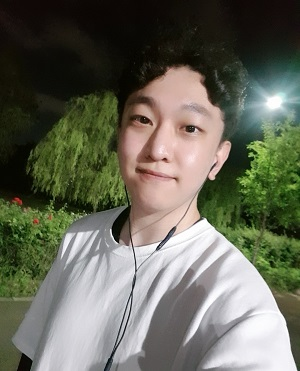

# **:pencil:** Guny's Resume

## 소개

### 주니어 개발자 윤건희입니다. (1992.8.7)

현재 Web Service / Front-end / Back-end Programming 을 공부하고 있습니다.

시니어 개발자가 되어도 겸손함과 배움의 자세를 잃지 않는 개발자가 되기를 목표하고 있습니다.

동료들과 함께 발전하는, 지금 모르더라도 원리를 이해하고자 노력하는, 끊임없이 성장하는 개발자가 되고 싶습니다.

- Email   : dbsrjs7687@gmail.com
- Github : https://github.com/Guny-Yun
- Blog : Velog 준비중입니다.

---

## :mortar_board: 학력

- 대일고등학교 졸업 [ 2008.3 ~ 2011.2 ]

- 연세대학교 원주캠퍼스(분교) 컴퓨터 공학과 졸업 [ 2012.3 ~ 2019.2 ]

---

## :book: 활동

- Tips 16기 [ 2016.12 ~ 2017.3 ]
  - TipsSoft 주관 MicroSoft 지원, 지식 나눔 코딩 강좌
  - 교육생 : C, C++, MFC 이론 및 실습 교육 과정으로 개발자로서의 성장 발판을 다졌습니다.
  - 강좌 기록 링크 : https://blog.naver.com/dbsrjs7687

- 삼성 청년 소프트웨어 아카데미 (SSAFY) '2기' [ 2019.7 ~ ing ]
  - 삼성전자 주관 고용노동부 후원 개발자 양성 과정
  - Java, Algorithm, Web을 기초로 6개월의 강의 수강과, 5개의 자율 프로젝트를 수행하며, 많은 동료들과의 소통, 협업, 다양한 문제해결 등 현업 개발 프로세스를 경험했습니다. 
  - 개발자로서 가장 크게 성장하게 되었고, 배움과 개발에 대한 인사이트를 얻게 되었습니다.

---

## :fire: 다뤄본 것들

- 언어
  - Java
  - JavaScript
  - jsp
  - SQL ( MySql )
- 프레임워크
  - React.js
  - MyBatis
  - Spring Boot
  - Swagger API
- etc.
  - REST API 설계 및 개발
  - 다양한 협업 툴
    - Git
    - Jira 
    - Slack
    - Mattermost
    - Zoom

---

## :hammer_and_wrench: 프로젝트 (최근순)

#### :pushpin:  ​IBomi 프로젝트

- 기간 : [ 2020.5.21 ~ 2020.6.9 ] (3주)
- 잠시라도 눈을 떼기 어려운 갓난아이를 돌보는 부모에게 약간의 여유(휴식, 화장실, 집안일, 작업 등)를 갖게 해주는 서비스 개발 프로젝트입니다.
- 라즈베리파이, RC카, 파이카메라, 모바일, 인공지능 기술을 활용한 아이 돌보미 인공지능 로봇 프로젝트
  - 모바일 어플리케이션으로 RC카(아이보미)와 페어링 합니다.
  - 인공지능 모델이 탑재된 라즈베리파이를 부착한 RC카가 카메라를 통해 오브젝트 디텍션을 합니다.
  - 오브젝트 중 아기를 찾아 약 1미터정도를 유지하며 따라다니고 카메라로 실시간 스트리밍을 합니다.
- 사용자(아기의 부모)는 모바일 어플리케이션에서 아기가 잘 놀고 있는지, 위험한 행동은 하지 않는지 확인합니다.
- 맡은 업무 : RC카 제작, Raspbian OS 카메라 연동 및 openCV를 이용한 사물 추적, RC카 움직임 제어

#### :pushpin: ​산타토스 프로젝트

- 기간 : [ 2020.3.3 ~ 2020.5.1 ] (5주)
- 취준생들의 스피킹 실력 향상을 위한 웹 서비스 프로젝트입니다.
- 인공지능(CNN + RNN, STT)을 이용해 '토익스피킹 파트 2'의 실력 향상을 돕습니다.
  - 서비스 웹 페이지에서 '사진을 업로드' 하거나 '랜덤 사진' 버튼을 클릭합니다.
  - 화면이 전환되고 'Test 시작' 버튼을 누르면 사용자는 45초 동안 사진에 대한 문장들을 말합니다.
    - Speach to Text 기능으로 웹 화면에 내가 말하는 문장들이 정확한 발음이라면, TextBox에 보여집니다.
  - 45초 간의 말하기 테스트가 끝나면, 인공지능 모델이 분석한 사진의 문장들이 정답으로 보여집니다.
  - 토익스피킹 테스트 파트2의 실력 향상을 위해 사용자는 위를 반복합니다.
- 기술 스택 : React.js, Flask(server), Python, Tensorflow, Git, Jira
- 맡은 업무 : Front-end (React.js), Front-end에 Google Speach to Text API 탑재

#### :pushpin: ​Opner 프로젝트

- 기간 : [ 2020.1.20 ~ 2020.2.21 ] (5주)
- 인스타그램, 왓챠(영화리뷰), 와인평점 웹 서비스 등을 벤치마킹한 '맥주 리뷰 SNS' 프로젝트입니다.
  - 사용자는 새로운 해외 맥주를 구매해보고 싶지만, 어떤 맥주가 어떤 맛일지, 내가 좋아하는 맥주와 비슷할지 다를지를 모릅니다.
  - 매장에서 휴대폰으로 맥주의 정면 사진을 찍고 'Opener'에 접속해 이미지 검색 서비스를 이용합니다.
  - 검색 결과로 나온 해당 맥주의 다른 사용자들의 별점 평균을 확인하고, 상세 정보와 다른 사용자들의 리뷰를 보고 맛을 가늠합니다.
  - 사용자는 해당 맥주를 구매하고, 맥주를 마신 뒤, 맥주를 마실 때의 모습을 자유롭게 사진으로 남겨 SNS 게시판에 게시합니다.
    - 이때 사진에 맥주가 있으면 자동으로 해시태그가 게시되고, 해당 해시태그를 누르면 상세정보와 리뷰 페이지로 이동합니다.
  - 인스타그램처럼 다른 사용자를 팔로우 하고, 그 사용자의 SNS 게시물, 맥주에 대한 점수 및 리뷰들을 따로 확인할 수 있습니다.
- 기술 스택 : React.js(Front), Spring Boot(Back), MySql(DB), Python(이미지검색 머신러닝, 크롤링), Git, Jira
- 맡은 업무 : 인스타그램 클론코딩, 반응형 웹 디자인, SNS 페이지 C.R.U.D, 전체 웹 디자인 총괄

#### :pushpin: Safe Food 프로젝트

- 기간 : [ 2019.11 ~ 2019.12 ] (3주)
- 식품 데이터를 통해 식품 영양 정보, 알러지 정보 등의 정보 제공 웹 프로젝트입니다.
  - 사용자는 다양한 식품을 검색해보고 칼로리 및 영양 정보를 얻을 수 있습니다.
  - 내가 먹은 식품들을 체크하고 식품들의 영양 정보 통계를 다른 사용자와 그래프로 비교해 볼 수 있습니다.
  - 간단한 커뮤니티 기능을 제공합니다.
- 기술 스택 : jsp, Spring Boot, MySql, Vue.js(일부)
- 맡은 업무 : Back-end 개발(각 기능별 Rest API), 커뮤니티 게시판 C.R.U.D(Vue.js)

---

## 📜자격증

- 정보처리기사
- 토익스피킹 Lv.5 (최소 Lv.6을 따고 말겠다.)
- SW역량 : IM (A+을 따고 말겠다.)

---

## :running: 공부 하고 있는 것과 하고 싶은 것

#### @ 하고 있는 것

- React.js (노마드 코더 강의 수강 中)
- Vanilla Js (노마드 코더 강의 수강 中)
- Kotlin (모바일 어플리케이션 관심, 유튜브로 강의 수강 中)

#### @ 하고 싶은 것

- Server things...
- Docker
- Kubernetes
- TypeScript
- JPA
- Data analysis
- Endless(끝이 없다...)

---

## :books: 좋아했던 과목 Top 5

| 과목명                | 성적 |
| :-------------------- | :--: |
| 데이터 마이닝         |  A+  |
| 인공지능              |  B+  |
| 정보 보안             |  A   |
| 운영체제              |  A-  |
| 프로그래밍 언어구조론 |  A-  |

- etc. : 서양 철학사, 프랑스 문화와 예술, 독일어, 미술사, 한국영화의 이해 등 문화 예술

---

## :rocket: 병역

- 공군 제 728기 병장 만기 전역 [ 2013.5 ~ 2015.5 ]
- 방공포병(단거리유도무기운용)

---

## :smile: 취미

- 달리기 / 마라톤 (동호회 활동 1년)
- 노래 부르기
- 미술 전시회 보러가기
- 게임 하는거 보기 (유튜브, 트위치)
- 영화 보기 (고전 명작)
- 맛집 탐방 / 이쁜 카페 가기
- 걷기 (하루 1만보 걷기)
- 따릉이 타기

---

## :deciduous_tree: 저는요... (하고 싶은 말)

1. 많은 사람들이 만족하는 서비스를 개발하고 싶습니다. 
   - 개발이라 함은 필요한 것을 만들어 내고, 불편함을 해소하고, 기존의 것을 개선시켜 나가는 것이라고 생각합니다.
   - 많은 사람들이 제가 만든 서비스를 오랫동안 사용했으면 좋겠습니다.
2. 팔로워? 리더? 코치!
   - 리더와 팔로워 사이에서 많은 고민을 했습니다. '나는 어디에 속하는가...', 저는 코치라고 생각합니다. 코치는 감독을 서포트하며, 팀원들과 감독이 200%의 기량을 발휘할 수 있도록 돕는 역할이라고 생각합니다. 

   - 저는 리더가 제시하는 비젼과 목표를 이해하고 팀원들과 나누며, 팀원들의 고민과 의견을 모아 리더에게 표현하는 중간다리 역할을 좋아합니다.

3. 공부하는 개발자
   - 모르는 것을 아는 것은 매우 중요하다고 생각합니다. 
   - 스스로에게 부족한 것이 무엇인지 끊임없이 묻고 새로운 것을 받아들이는 마음가짐은 개발자로서 필수 역량이라고 생각합니다.
   - 모르는 것을 채워가는 과정을 즐기겠습니다.

4. 듣는 개발자
   - 전공자, 비전공자, 비개발자 등 다양한 사람들과의 개발 경험을 통해 듣는 행위의 중요함을 알게 되었습니다.
   - 항상 마음과 귀를 열고, 겸손한 자세로 들으려고 노력하겠습니다.
   - 배려와 존중으로 듣겠습니다.

5. 누구나 아는 개발자
   - 저의 N년 뒤 평판은 아래와 같았으면 좋겠습니다.
     - "건희랑 일했을때 진짜 좋았는데"
     - "사람 진짜 좋아 같이 프로젝트 또 하고 싶어"
     - "그 프로젝트 진짜 힘들었는데, 건희가 팀원들 멘탈케어 다했지~"

---
